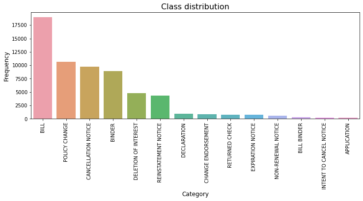
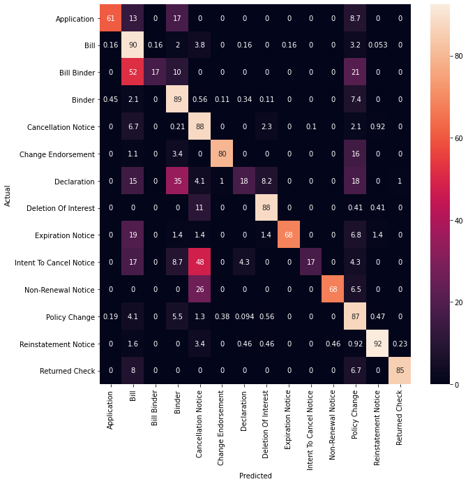
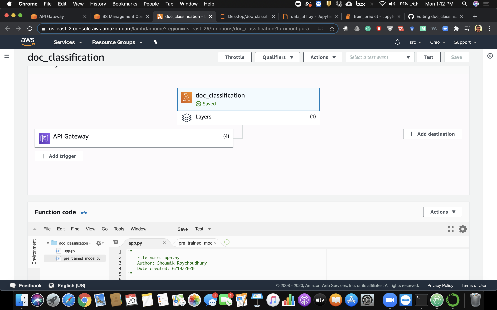
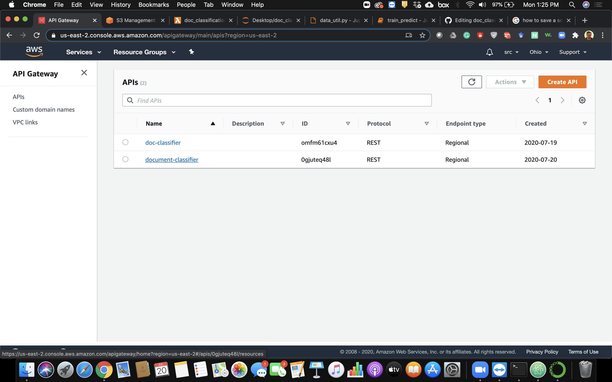
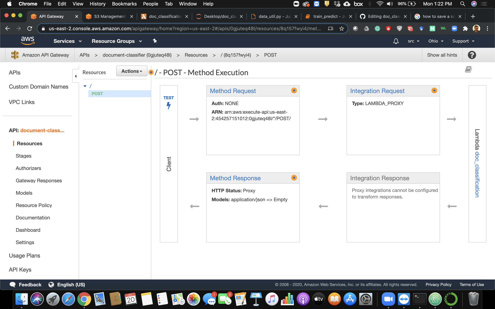
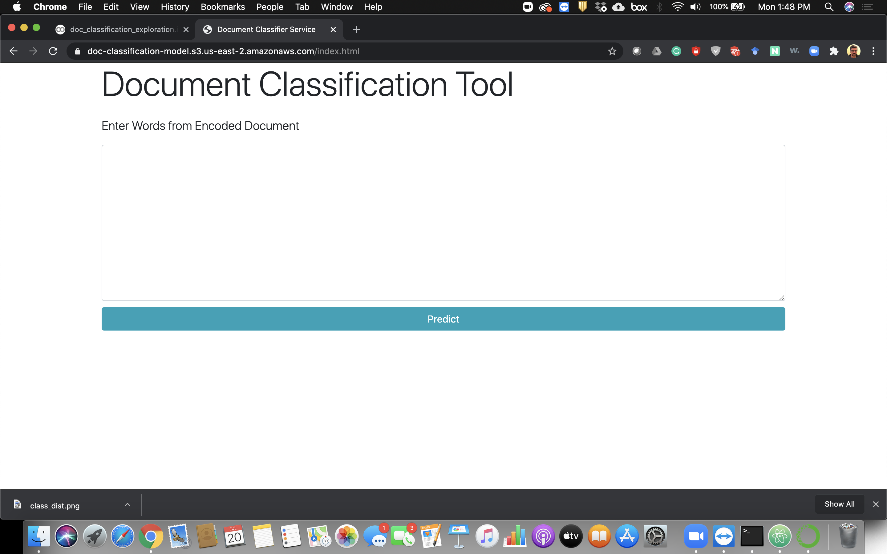
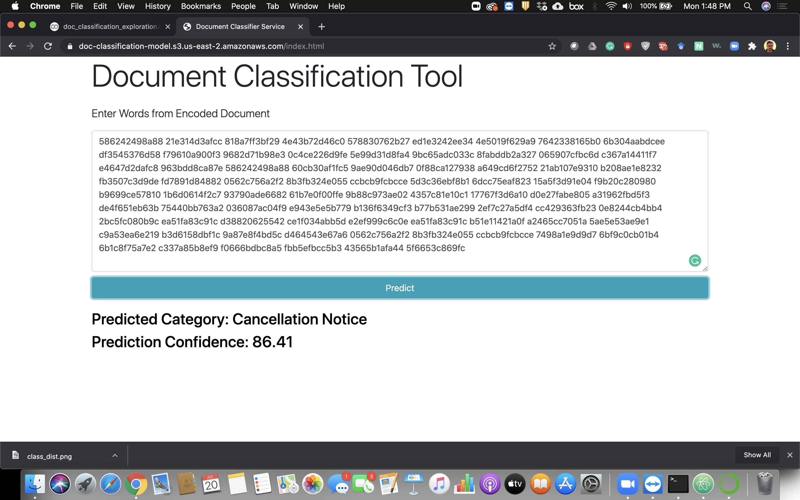

# Black Knight document classification problem

## Problem statement
Black Knight operations involve processesing documents related to mortgages. They often only have access to a document we have is a scan of a fax of a print out of the document. Their system is able to read and comprehend that document, turning a PDF into structured business content that in turn their customers can act on.

The dataset provided represents the output of the OCR stage of the data pipeline. Due to sensitive nature of the financial documents the raw text has been obscured by mapping each word to a unique value. If the word appears in multiple documents then that value will appear multiple times. The word order for the dataset comes directly from the OCR layer, so it should be roughly in order.

## Objective:
1. Train a classification model

2. Deploy the trained model to a public cloud platform as a webservice

## Part 1 Machine Learning phase

The python notebook doc_classification_exploration.ipynb corresponds to the exploratory data analysis phase of the provided dataset and the benchmarking of different classification models. The objective is to understand the data and identify the best classification model to be deployed as a webservice. 

### Conclusionfrom exploration phase: 

#### Document category distribution

Benchmarking

Next based on the observations, LOGISTIC REGRESSION model with L2 regularization was selected to be deployed as a webservice for document classsification. It had the highest average test accuracy with good generalization. The notebook train_predict.ipynb trains a model and saves the trained model as a pickle file to be used later in the web deployement phase. The TF-IDF Vectorizer from the feature transformation phase is saved as vectorizer.pkl. This pickle files helps to load the learned TF_IDF matrix which shall be used to transform the query document during testing the document classifciation web tool.

To have an idea about the trained classification model's performance, the data was split to train/validation (90%/10%) using stratified sampling as the distribution of classes is unbalanced. The confusion matrix of the validation set is as follows.

## Part 2 Web deployment phase

In order to deploy the trained model as a public webservice, I decided to deploy the model as a AWS Lambda function. The frontend index.html file along with the pretrained.pkl model and the vectorizer.pkl model was uploaded in a AWS S3 bucket. A Scikt-learn layer is also uploaded in the S3 bucket. The following series of commands was used to make the sklearn_layer zip file:

1. docker run --rm -it -v $pwd:/var/task lambci/lambda:build-python3.7 bash : initiate docker container for a python enviornment
2. pip3 install scikit-learn==0.23.1 -t python/lib/python3.7/site-packages/ : install sckit-learn package 
3. zip -r sklearn_layer.zip * : zip the package
4. docker ps : get the container id
5. docker cp a5f847590d99:/var/task/sklearn_layer.zip ~/ : copy the zip file to the container.

Next, a lambda function is created containing 2 files app.py and pre_trained_model.py

API is created with REST protocol and a post method is created and deployed. Following are the screenshots. 

The public url to view the webservice running as a AWS Lambda function:

https://doc-classification-model.s3.us-east-2.amazonaws.com/index.html

The following screenshot demonstrate the working of the webservice:

The input in the text field is a encoded document in the following format:

######  586242498a88 21e314d3afcc 818a7ff3bf29 [...] 7498a1e9d9d7 6bf9c0cb01b4 6b1c8f75a7e2 c337a85b8ef9 f0666bdbc8a5 fbb5efbcc5b3 43565b1afa44 5f6653c869fc

The following series of test cases were used to verify the webservice functionality. These test cases were extracted from the original data and were not used for training the machine learning model.

Testcase 1: Label = CANCELLATION NOTICE:

586242498a88 21e314d3afcc 818a7ff3bf29 4e43b72d46c0 578830762b27 ed1e3242ee34 4e5019f629a9 7642338165b0 6b304aabdcee df3545376d58 f79610a900f3 9682d71b98e3 0c4ce226d9fe 5e99d31d8fa4 9bc65adc033c 8fabddb2a327 065907cfbc6d c367a14411f7 e4647d2dafc8 963bdd8ca87e 586242498a88 60cb30af1fc5 9ae90d046db7 0f88ca127938 a649cd6f2752 21ab107e9310 b208ae1e8232 fb3507c3d9de fd7891d84882 0562c756a2f2 8b3fb324e055 ccbcb9fcbcce 5d3c36ebf8b1 6dcc75eaf823 15a5f3d91e04 f9b20c280980 b9699ce57810 1b6d0614f2c7 93790ade6682 61b7e0f00ffe 9b88c973ae02 4357c81e10c1 17767f3d6a10 d0e27fabe805 a31962fbd5f3 de4f651eb63b 75440bb763a2 036087ac04f9 e943e5e5b779 b136f6349cf3 b77b531ae299 2ef7c27a5df4 cc429363fb23 0e8244cb4bb4 2bc5fc080b9c ea51fa83c91c d38820625542 ce1f034abb5d e2ef999c6c0e ea51fa83c91c b51e11421a0f a2465cc7051a 5ae5e53ae9e1 c9a53ea6e219 b3d6158dbf1c 9a87e8f4bd5c d464543e67a6 0562c756a2f2 8b3fb324e055 ccbcb9fcbcce 7498a1e9d9d7 6bf9c0cb01b4 6b1c8f75a7e2 c337a85b8ef9 f0666bdbc8a5 fbb5efbcc5b3 43565b1afa44 5f6653c869fc

Testcase 2: Label = BILL:

cdee33987473 25c57acdf805 586242498a88 f7ae6f8257da 98d0d51b397c dea246a2a089 3bb6ed305ace 2dcc7294c5eb 5db3fa1df531 eeb86a6a04e4 46e069a50701 10e45001c2f2 eca16ee06b98 6a01047db3ab cbfb3eb99bea 2b938ff7738e 9a00a4a4b020 0f6cb07676b9 d2fba859c54b b6644d301159 9a8982068d54 54edaa3eac8d 395a5e8185f8 1015893e384a 9201295d9a84 aefa523cd4b9 246a95db3931 42b3a7dea3f2 10e45001c2f2 ba8f19d976a8 530fd2faa74a 5fa62998872f 42e393bc7d8e eeb86a6a04e4 f4424062c08e 5a9acea8ea36 8e7dd3141e2e d1c3631d621b 5698b3115633 42557ab73317 448cca02dae6 e943e5e5b779 8d21095e8690 1ab34730c1e0 54709b24b45f eeb86a6a04e4 98d0d51b397c 918d14133622 3f154cb71bdf 847c3d168310 9e3426e7c1cb 0f6cb07676b9 b6644d301159 54edaa3eac8d 1015893e384a 586242498a88 f2b0e028fe2c 422068f04236 8e7dd3141e2e 530fd2faa74a b136f6349cf3 1ed079de7c6c 6e86c10fc88e 3012dd989e4f 24d1ab9d7766 de9738ee8b24 5be138559904 25c57acdf805 fb2cd24a447a aba2239ec163 e4a63237312c 52102c70348d c337a85b8ef9 f36e139d9400 580a08f5c8b9 ca383658800f 641356219cbc 422068f04236 6099f4533cc2 471119cf14ce 3eee1ce2a7bf 6af770640118 c337a85b8ef9 6df520735456 e4a63237312c 52102c70348d 6ab3b7c68009 c337a85b8ef9 641356219cbc f36e139d9400 e4a63237312c 52102c70348d 580a08f5c8b9 422068f04236 e4a63237312c 52102c70348d ca383658800f 641356219cbc 446c804d79cc ffe8decfd82e 641356219cbc 641356219cbc 422068f04236 422068f04236 6099f4533cc2 f7ae6f8257da 6099f4533cc2 eeb86a6a04e4 dec250bd255f 0302af775b89 2173befb1f1b ccfcf53939d5 b73e657498f2 d5f4611022c1 f62c5f87f0af fdb96e216207 54709b24b45f 25c57acdf805 373607889b46 c337a85b8ef9 b19b0b4bbe49 8f7a92cd0ae7 a20e78c41cf9 580a08f5c8b9 9a49132a5847 1015893e384a a5f8a7c9a886 586242498a88 264b544cefee 5dea521c4e2a 6ce6cc5a3203 31fdb28ad1d7 6d1fb90988cf cc9e05bc2a86 cde4f1b2a877 15a2389a650e d9142bb5fbe2 1068682ce752 9bc65adc033c 6bf9c0cb01b4 0562c756a2f2 3c2378cbd628 83f8b75d8fe3 fe7ea318c1ac 964d8858954c 46c88d9303da 667804d39f8b 1e1cf4f1b953 8de819b41a92 430ac7448a1d 586242498a88 586242498a88 46e069a50701 eca16ee06b98 c337a85b8ef9 25c57acdf805 f36e139d9400 87b8193a0183 fb2cd24a447a 580a08f5c8b9 3bb6ed305ace 2dcc7294c5eb d2fed0e65ee8 2173befb1f1b 5db3fa1df531 cbd6e2e7a804 6ca2dd348663 7d9e333a86da f62c5f87f0af cdee33987473 25c57acdf805 f7ae6f8257da d2fba859c54b 76a51f2eec08 9a8982068d54 ff714b9fa7fd 9cdf4a63deb0 395a5e8185f8 9201295d9a84 f4424062c08e 6172f16911ce df330922aae2 5a9acea8ea36 fea862065b74 7d9e333a86da cbfb3eb99bea 641356219cbc e4a63237312c 52102c70348d f62c5f87f0af 422068f04236 6099f4533cc2 422068f04236 2b938ff7738e 641356219cbc eeb86a6a04e4 b1e53262ec60 0f150526b215 294ef1562672 24f00d5fadd3 4bcd7bd4b757 54edaa3eac8d 93790ade6682 61b7e0f00ffe b7a0f56f6ce8 446c804d79cc 4357c81e10c1 a31962fbd5f3 31fdb28ad1d7 ffe8decfd82e 1015893e384a fb2cd24a447a 641356219cbc dea246a2a089 889c82556e90 422068f04236 75440bb763a2 d2fba859c54b 6099f4533cc2 036087ac04f9 dc63bc654639 2cbc2b5e61bb 54709b24b45f b1abddb99d7a 4c28a4682bf5 fe7ea318c1ac b6644d301159 530fd2faa74a 2ef7c27a5df4 ea51fa83c91c cbfb3eb99bea 2173befb1f1b b51e11421a0f f62c5f87f0af a2465cc7051a c9a53ea6e219 1ab34730c1e0 9a87e8f4bd5c 66519528d764 2f9d0e29e96a 252df78553ff 9fd4f198c19a 4eb799ec0fb4 54709b24b45f f816f047c0db 10bc6d04c2ad e60b77c37f17 eeb86a6a04e4 2685f0879380 eb51798a89e1 133d46f7ed38 b136f6349cf3 421e52f8278f d38820625542 8e7dd3141e2e d8afd84c6fa9 918d14133622 050b46aa8873 580a08f5c8b9 fbb341a91a12 1bbe797157cb 20d53168dbb6 b73e657498f2 e943fd8ad877 6bfb5db98ef3 2390376b5af4 1c303d15eb65 f62c5f87f0af ed1e3242ee34 3c680a311a05 1bbe797157cb 6bff0c8c1185 036087ac04f9 b136f6349cf3 7d41ca882f26 ab0ea8f20370 4a1fc4b235f6 e98d377b2b9d cc65f20e23da ab04416c57df 6ce6cc5a3203 798fe9915030 f2db1ce59725 2fd423ce5514 8e93a2273a93 1015893e384a 797c9990becb 6565086a90b1 586242498a88 abb8303deaf3 ecee69844b4e cc429363fb23 6365c4563bd1 43565b1afa44 5850dd7f87db ff714b9fa7fd 79aa7fd11cec 75662b23ecc7 7d9e333a86da f36e139d9400 f62c5f87f0af 5948001254b3 26f768da5068 6af770640118 688506733f41 10e45001c2f2 41a0ee0cf31a c87d29676bd1 4faebb8051b2 cb5d824045a6 22d6fd31d92b e3d61318ef03 036087ac04f9 2bcce4e05d9d b136f6349cf3 6224822e75cf cc429363fb23 abe7d2dd7c9b 43565b1afa44 9067496902b8 f0bce85c6eda f8931fcd9bd6 4f838b97d76c f0bce85c6eda 6b304aabdcee 0b5273ff6b8d 20d53168dbb6 2db9cd0d1e86 79aa7fd11cec d868896426ad

Testcase 3: Label = BINDER

586242498a88 69d7f24403d6 cbd6e2e7a804 0d5c6a460006 be23b603990f 6b304aabdcee 6b304aabdcee 7d9e333a86da 46c88d9303da 98b1b0a5dd91 754980538d32 9075c16eb07d 3dc0896ff820 97b6014f9e50 cb60d1bc4a3c 996962a673ac 0c4ce226d9fe 8203e79f4eea d38820625542 e7f10ad56136 eb51798a89e1 32fde165c704 01d0d798f3cb 247cd4415ff7 1ac92a1f4639 6fe9d77f648a 968375f8a217 422068f04236 2fba4eeb0855 d38820625542 cf6e30467290 7e3632031569 422068f04236 bcc1cc73d2e1 1068682ce752 f11e7777d8b5 1068682ce752 b3bd055c3bd6 1068682ce752 d572dc50fdd4 f0cbefbf0a06 5b9537791a91 10e45001c2f2 40cb5e209b92 f4240a35fd08 312c2865fe4e c8846f67f74b 74ebbd290d02 6ce6cc5a3203 028eecc89c67 1851758c92b2 e94953618947 ce015f48ae93 881a3745f5bc d38820625542 cbd6e2e7a804 4648a8b2cf8d 133d46f7ed38 6ce6cc5a3203 0908d30f97bc 6a91bc1974fa b814d9d78802 97b6014f9e50 c7c46a3ab23b 00244c4266f4 d1d42573097e 6ce6cc5a3203 996962a673ac 8b363e6fdb6a 878e15725b7b 80581852cb35 0f12fd1c2b99 ce68d85c1b08 31fd3123f41c 6b304aabdcee 23cf69a5790e 2ff07011cf88 bba9430547aa 163a151d4df2 1068682ce752 1068682ce752 cdafe7449287 6b304aabdcee 6b304aabdcee d38820625542 236eeaf59a18 6393233a2fd9 067a8083c8cb db0a62e70176 2b2acdf4a3ed 98d5139855cc f4cd8f4aca8a e5df8e8bd43c e0a08df8ec4c 26f768da5068 a2f275a76634 aa1ef5f5355f cd50f04925dd 3d7e43c8baf2 b20bb43f3cb9 1068682ce752 1068682ce752 7b5fc7b4a3b7 d38820625542 91a51adac923 f0aff59dccd6 aa1ef5f5355f 4ccadce1562e b20bb43f3cb9 8f75273e5510 ddc14a5b99aa 33bfc554cf75 1068682ce752 1068682ce752 6ca2dd348663 1068682ce752 bae6309d355b 1015893e384a 5be138559904 04503bc22789 5c02c2aaa67b e943e5e5b779 ee864a6f4b2f 15c1054cfa3d 2c99f43173a1 d79cdad75c7c 23dc8a5d670d 2b2acdf4a3ed 37b722b32dc6 cd743f630d09 1807f8910862 b4804825d6f9 ba02159e05b1 6ce6cc5a3203 4f88a85c9f99 fe1be10e7c61 dd403a139cff 236eeaf59a18 2b2acdf4a3ed b87f34b0269a 0a26705a79dc ccbfb6eaecd0 d572dc50fdd4 b38e85157d7f 9c5e043ef458 440f6b05cd7c efd57f53e64f 8b363e6fdb6a 86d9aacb3b33 0091654f2971 3c1ddf0ab4bf 663a58de1259 b8b3286d45ac b4fcf37f996c 1068682ce752 b9699ce57810 75d0c28f0816 f7ae6f8257da 87b8193a0183 fb6e18c81864 c8846f67f74b 43d186e2a89e 25c57acdf805 e943e5e5b779 a4294cd329cf b208ae1e8232 ebc6d3bc7bc6 5b9537791a91 abb46ad526c0 76035f416270 246ee0c4577b 018957bc02ba 9756da26a44d 32f0906a058f 12db8d7a0bb2 2e2c010b1121 f270199b9e53 65f888439937 6b343f522f78 f95d0bea231b 57962002319d 9ecaa4568123 c8dad86e7101 18a3e15448da ff714b9fa7fd 236eeaf59a18 2b2acdf4a3ed 8d21095e8690 ed5d3a65ee2d 04b71d15d771 d5f4611022c1 ea0bfab5eded 7f37f318171a 7d9e333a86da fe081ae57a8b 45e16cbae38f 7d9e333a86da 8f75273e5510 7d9e333a86da 57d1917ce993 a9ee836e8303 ce015f48ae93 8fc4ec925d63 41d2b8c290b4 15a14705dc64 8f75273e5510 35e4249b00ea bad6ff5dd7bc 9bc65adc033c e504ee0aaf6d af056078c0e2 22d4ced81957 5948001254b3 ddcfb3277250 b5f2d222916c ec47e82568de cb7631b88e51 89f10a5eec59 6963eb4de6e8 f89a9406e6ff a2aff7e5a60b 11c22eefd84c e943e5e5b779 a30180d7f9e4 97b6014f9e50 b4f302ac7019 b750c24ba27a c188eec4e31f c85b3821556b 6ce6cc5a3203 df4e673e6279 744f4c2f0f3d 9b002bb8ea70 e9f71ee8ed7b 3d7d3428b9ba cbd6e2e7a804 46c88d9303da 30ca33997a38 33b232e813e5 2556150a673a 5d7641b096f0 b758f3f461f5 8f75273e5510 b9699ce57810 240f132acfee 5244cc8037df 6650959e7449 f0666bdbc8a5 23748340710d 82b64ffd1dba 0c6abfc5987a f11e7777d8b5 c82f81aceeab e569d1bbc284 e259a56993f4 9df59c5531c2 20cd239fc925 c913f5129fe2 5b9537791a91 ce015f48ae93 58d5a3cd6a0b 9525522cdf8d 6ce6cc5a3203 6b304aabdcee 0c0851113504 cbe9a139c615 f5e80bb967cc 16d2fa27caf8 c6dca28b103a 7d4c99f861e3 95aaad3c84ce 9bc65adc033c c30d1007fcf8 6ce6cc5a3203 f02470fde6a7 f89270a78898 df135d744c62 816767117c83 64833966bcb1 02e4c4113d25 159bc0ef045f e43c4b6f2c61 ed33e9716100 8fa7660b356c 1015893e384a 558adc5b0cef bb11d257e651 6619215e5791 b3c577f27b2d fc71a476f168 8e6114bf779f da75356936c0 85f1991ec7f5 9f7ecf3c4c72 10e45001c2f2 56a98b3105ce 558adc5b0cef 1068682ce752 fe3fe35491b4 f64cbd4354c6 1068682ce752 89ac7caf786b 9fc097bdc653 569a5f7d7989 6ce6cc5a3203 5e457dbcb75c 7750bf1ed9fe a86f2ba617ec d3f89b87032c d0f129ed7e40 8c216e65faef 0e4081748b3d 889da325b797 6af770640118 ef3d34e2077e 6b304aabdcee abe7d2dd7c9b e29b779694a5 6b304aabdcee 10e45001c2f2 23eb13f3100f d01187cf5115 29a6ba38decf 0562c756a2f2 04503bc22789 c85b3821556b 9386688bdce5 8e6114bf779f ce015f48ae93 5c02c2aaa67b 97b6014f9e50 72803add6a44 047b3d1a8f9f 6b304aabdcee 1ffa2b9a97b1 a0c020166d79 93564716f685 9a4f8858a8e2 38931605e527 ac6de17df368 ce015f48ae93 5ae5e53ae9e1 97b6014f9e50 a1bb6b4223d9 0562c756a2f2 b9699ce57810 4b4bb78cebae 6268acdd0792 b2c97444f514 a14ed98ea3a0 1068682ce752 ed8f62ec5528 8b363e6fdb6a 93f74477ec1d 97b6014f9e50 720027f3e055 c0082b0f09cc 8b363e6fdb6a d5d6c0f8f797 2362645f30fe d51a223ae2d2 5ec5e1ba1d01 5d1a9242f98e 6af770640118 6b304aabdcee 97b6014f9e50 6ce6cc5a3203 609fc049fe38 79821801f7d1 dec250bd255f a61eb636c9e8 45c7bd05a6f3 6a91bc1974fa 6ce6cc5a3203 5ae5e53ae9e1 9de56cbee28f 0de92bd273e4 9822b07a8998 c53d33060972 094453b4e4ae 8e6114bf779f fd472c1d0873 65f18c06f5c6 586242498a88 037b783ea3ea 1068682ce752 c29dfb77f729 02a815a885bd 094453b4e4ae 5b1be435f4c7 6b304aabdcee 52ae21dab261 094453b4e4ae 8fc4ec925d63 52845da35926 3800efe87c6f 6be3b3f9507f 6b304aabdcee 97b6014f9e50 a194c5642e02 7d9e333a86da 367409b37b2a e1e52eebfc13 65f888439937 dbebdce3086b fe64d3cdfe5b 494c486bfa24 fb3e321eb4f6 7d9e333a86da 8ce2b5178365 106de4332a24 d572dc50fdd4 2e053a954cae 9075c16eb07d cc429363fb23

Testcase 4: Label = DECLARATION

094453b4e4ae d63be9e66da8 aa5b17d101b3 16d7d169f725 d63be9e66da8 d0499d87c196 10906ed69f57 54a7b597b922 5e99d31d8fa4 6ca2dd348663 36ad55161f1c fb2cd24a447a 0a570a3d2a4b e43c4b6f2c61 ed3a350e7a9a 6af770640118 fafd881e4b7e 26f768da5068 6af770640118 9bc65adc033c c8264563caff 26f768da5068 845516e74924 e8db1fda0d74 d2cabcd692f6 c377a564ec5d 036087ac04f9 b136f6349cf3 02bd2f6af4e2 97b6014f9e50 8d1e3c1e9181 b12aa166d512 7575d2a15587 ddb55480e542 afb1e3806fc1 67f621c381c1 664d4af58325 de2ba2aedaab 29a67ab1c7dc e9068315b2d6 f4240a35fd08 d38820625542 10906ed69f57 6ca2dd348663 f2b0e028fe2c 48d657cd9861 422068f04236 f52671c3d5de 641356219cbc 628af33857b5 21e314d3afcc cd4c3c5e83cc 607f445d8dca c9a53ea6e219 6bf9c0cb01b4 be9f9e5522c9 b32153b8b30c 1c131af9052d ea51fa83c91c cbfb3eb99bea 43565b1afa44 9ec0724c2677 8e93a2273a93 6ce6cc5a3203 798fe9915030 c61acd1dec15 73fb03030450 aa5b17d101b3 2685f0879380 641356219cbc 10906ed69f57 d0499d87c196 35991d8609e2 4faebb8051b2 1a90e60441d0 6bff0c8c1185 e7e059c82399 1918bab7ef7f d0499d87c196 f52671c3d5de 6ce6cc5a3203 525cf0badd83 71b05e030809 036087ac04f9 431392fb12c7 6d0e2fd79001 22d6fd31d92b 641356219cbc 586242498a88 918d14133622 628af33857b5 21e314d3afcc 8e93a2273a93 36ad55161f1c 6ce6cc5a3203 798fe9915030 06bf20fdaf0e cab3c6db7733 ddb55480e542 b136f6349cf3 099a35c6f710 f3fe35f0ec35 95ca19064d33 7c4dfc651f3f 95ca19064d33 db5acc520d5f b9699ce57810 36ad55161f1c 6ca2dd348663 2ef7c27a5df4 93c988b67c47 e27acd17313e 6365c4563bd1 ecee69844b4e 6565086a90b1 aa5b17d101b3 25c57acdf805 b73e657498f2 8e93a2273a93 6ce6cc5a3203 fe081131ed3c 8495f80cf292 9f3538f3b26d ddb55480e542 431392fb12c7 1b6d0614f2c7 03ea9b9cef7d e7e059c82399 6bf9c0cb01b4 be9f9e5522c9 b32153b8b30c 641356219cbc b9699ce57810 5e49764f19ac abf52fd782d8 da61efdd2b77 67f621c381c1 e7e059c82399 b9699ce57810 11b7ac92644e e7e059c82399 6bff0c8c1185 1015893e384a 07b4174549d4 ae26e97b8730 40d7c26d7f9e ec56ff31bb7a b9699ce57810 1b6d0614f2c7 41a0ee0cf31a 733a1a088236 4faebb8051b2 22d6fd31d92b 54709b24b45f d38820625542 eca16ee06b98 e7e059c82399 6bff0c8c1185 71b05e030809 442ad4d88672 d83ee2d00e1b d380df130a8d dc83f2b00468 1068682ce752 dd2b6b7f3258 6bb26d7345d9 6ce6cc5a3203 e71476525673 20d53168dbb6 550ce2c68339 1d23929a787d 1548e6c17b35 2e85d01c5d75 2e85d01c5d75 2e85d01c5d75 c85b3821556b bee90f8bc570 6ce6cc5a3203 525cf0badd83 c56faf482d19 ce1f034abb5d 792357aaf983 1b6d0614f2c7 cf4fc632eed2 431392fb12c7 71b05e030809 d9154c7af554 c690f298f86b ba8f19d976a8 641356219cbc 03ee6f922041 0562c756a2f2 431392fb12c7 041a934b1778 25c57acdf805 525cf0badd83 b73e657498f2 586242498a88 628af33857b5 21e314d3afcc 71b05e030809 ba8f19d976a8 878460b4304e 586242498a88 422068f04236 5612cc768ae7 0562c756a2f2 431392fb12c7 d8afd84c6fa9 0562c756a2f2 431392fb12c7 041a934b1778 dd18fc3f82e2 21ab107e9310 cc20b40a2c48 8f75273e5510 6ce6cc5a3203 c337a85b8ef9 a024d1e04168 cd4c3c5e83cc ce1f034abb5d 85428633f643 9f11111004ec 0ad17934ee05 06e7c4534cb7 54709b24b45f 54a7b597b922 7d9e333a86da ed5d3a65ee2d 1015893e384a 5e99d31d8fa4 cd50f04925dd 25c57acdf805 eca16ee06b98 f2b0e028fe2c a20e78c41cf9 243d2eb54034 cd50f04925dd 21ab107e9310 cc20b40a2c48 8f75273e5510 5612cc768ae7 04503bc22789 7d9e333a86da d0499d87c196 10906ed69f57 10520efc20b5 757024259e21 07315ce641ce 54a7b597b922 1015893e384a 5e99d31d8fa4 9c88ca74e4b4 1015893e384a 5e99d31d8fa4 3a6e342fba40 1bf0770d8194 b59e343416f7 5c02c2aaa67b a40612661a40 5e99d31d8fa4 9f11111004ec 0ad17934ee05 4ea26e7f2129 c337a85b8ef9 5c02c2aaa67b a024d1e04168 bfd5473272d3 1bf0770d8194 b59e343416f7 4ea26e7f2129 6d10c76d455a ce1f034abb5d 85428633f643 6ae054d1dcb7 6ae054d1dcb7 2efbc21a469b 6ca2dd348663 36ad55161f1c 094453b4e4ae d63be9e66da8 aa5b17d101b3 801b08c3d068 0562c756a2f2 c337a85b8ef9 3a6e342fba40 641356219cbc 93c44420a2d7 25c57acdf805 066dd4fe77b4 eb562127f33e a7d5869f57c1 d63be9e66da8 d38820625542

Testcase 5: Label = CHANGE ENDORSEMENT

461edd1ddaa6 586242498a88 56c2c356d772 cc429363fb23 9cdf4a63deb0 17593fe7d418 1d6c213c57ca 54709b24b45f 861556cca5fd c913f5129fe2 4e5019f629a9 479e6e2b5afc 3cb82dbee72a fb279192f4cf b17bbc0ea77b d01187cf5115 1d6c213c57ca 04503bc22789 7ec02e30a5b3 df4a8b563157 112afe1f7d8a 5fa62998872f d38820625542 5768721c4059 54fe543502cd 2985f1045d62 d464543e67a6 b136f6349cf3 cbfb3eb99bea 036087ac04f9 8f3164e13b28 04503bc22789 f81146092cfc 7d9e333a86da d38820625542 c4d66be0069d d44f56765ac3 553392016929 f7ae6f8257da 347a5d991fe1 1015893e384a b814d9d78802 586242498a88 6868362b998e cd4c3c5e83cc fe081131ed3c 2b3336bc6749 90b868693b82 6ca2dd348663 6141afd04501 1b735a91cad4 f9aeb47c4f9a 40cb5e209b92 6b343f522f78 d38820625542 5cead1de2533 26987a0d44d1 0f88ca127938 b208ae1e8232 21ab107e9310 1010cecb0f1b 1701fc4921b6 2b5eec85d917 8b6c5bb157a9 98bfc086a211 55ff17488df6 9cdf4a63deb0 de1c5e14d795 efd7b75f31c6 1450168c4ac2 66468d27003f 99b3c6973086

Upon pressing predict button the predicted category of the input document and the prediction confidence is shown as follwing:

