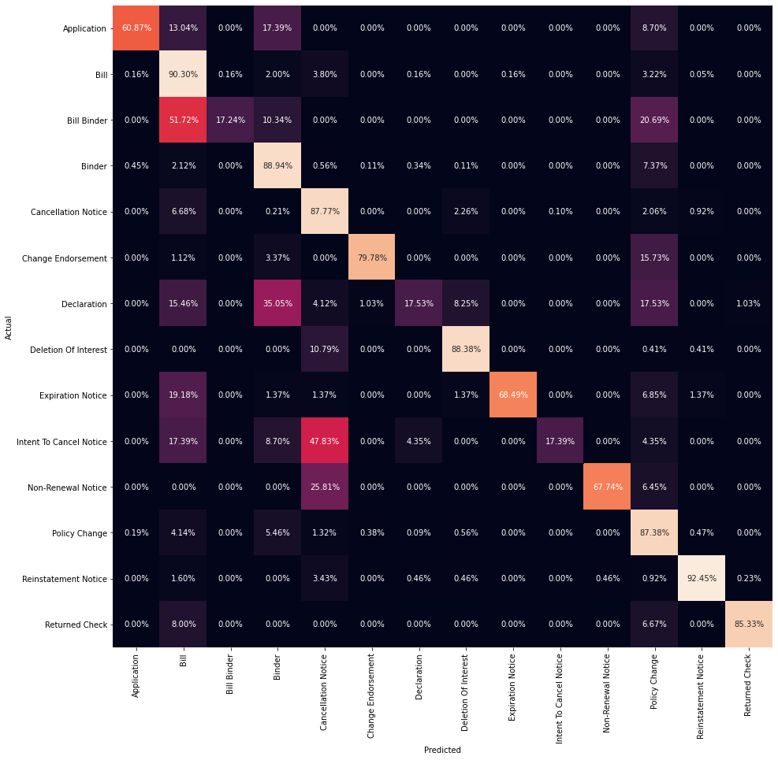

# Black Knight document classification problem

## Problem statement
Black Knight operations involve processesing documents related to mortgages. They often only have access to a document we have is a scan of a fax of a print out of the document. Their system is able to read and comprehend that document, turning a PDF into structured business content that in turn their customers can act on.

The dataset provided represents the output of the OCR stage of the data pipeline. Due to sensitive nature of the financial documents the raw text has been obscured by mapping each word to a unique value. If the word appears in multiple documents then that value will appear multiple times. The word order for the dataset comes directly from the OCR layer, so it should be roughly in order.

## Objective:
1. Train a classification model

2. Deploy the trained model to a public cloud platform as a webservice

## Part 1 Machine Learning phase

The python notebook doc_classification_exploration.ipynb corresponds to the exploratory data analysis phase of the provided dataset and the benchmarking of different classification models. The objective is to understand the data and identify the best classification model to be deployed as a webservice. 

### Conclusionfrom exploration phase: 

#### Document category distribution

Benchmarking

Next based on the observations, LOGISTIC REGRESSION model with L2 regularization was selected to be deployed as a webservice for document classsification. It had the highest average test accuracy with good generalization. The notebook train_predict.ipynb trains a model and saves the trained model as a pickle file to be used later in the web deployement phase. The TF-IDF Vectorizer from the feature transformation phase is saved as vectorizer.pkl. This pickle files helps to load the learned TF_IDF matrix which shall be used to transform the query document during testing the document classifciation web tool.

To have an idea about the trained classification model's performance, the data was split to train/validation (90%/10%) using stratified sampling as the distribution of classes is unbalanced. The confusion matrix of the validation set is as follows.

## Part 2 Web deployment phase

In order to deploy the trained model as a public webservice, I decided to deploy the model as a AWS Lambda function. The frontend index.html file along with the pretrained.pkl model and the vectorizer.pkl model was uploaded in a AWS S3 bucket. A Scikt-learn layer is also uploaded in the S3 bucket. The following series of commands was used to make the sklearn_layer zip file:

1. docker run --rm -it -v $pwd:/var/task lambci/lambda:build-python3.7 bash : initiate docker container for a python enviornment
2. pip3 install scikit-learn==0.23.1 -t python/lib/python3.7/site-packages/ : install sckit-learn package 
3. zip -r sklearn_layer.zip * : zip the package
4. docker ps : get the container id
5. docker cp a5f847590d99:/var/task/sklearn_layer.zip ~/ : copy the zip file to the container.

Next, a lambda function is created containing 2 files app.py and pre_trained_model.py

API is created with REST protocol and a post method is created and deployed. Following are the screenshots. 

The url to view the webservice running as a AWS Lambda function:

https://doc-classification-model.s3.us-east-2.amazonaws.com/index.html

